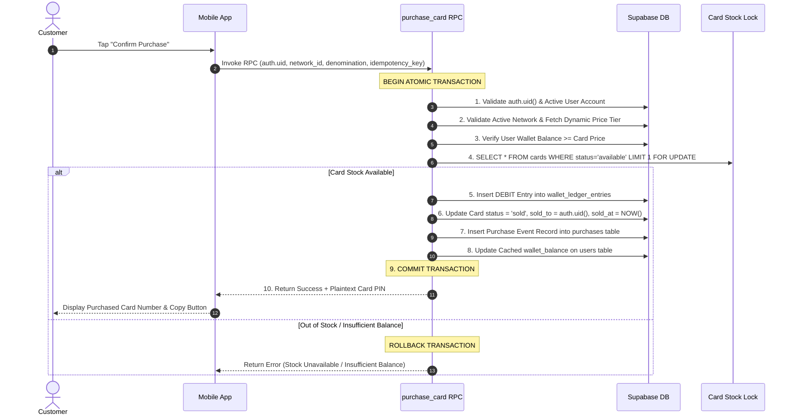

# NETYEMEN FINANCIAL & LEDGER OPERATING CONTRACT (V1.0)

**Task ID:** NY-PRODUCT-001  
**Document Code:** `NETYEMEN-FINANCIAL-OPERATING-CONTRACT-01.md`  
**Classification:** `PROPOSED_CONTRACT`  
**Scope:** Double-Entry Accounting Rules, Financial Invariants, Purchase Atomicity, and Reconciliation  

---

## 1. Wallet & Double-Entry Accounting Model

To guarantee 100% financial integrity, NetYemen employs an **Append-Only Immutable Ledger Architecture**. Wallet balances are NEVER updated via direct arithmetic modifications on database tables. Every movement of funds is represented by a double-entry or verified single-direction ledger record.

```
+-----------------------------------------------------------------------------------+
|                           IMMUTABLE FINANCIAL LEDGER                              |
+-----------------------------------------------------------------------------------+
|  - id (UUID Primary Key)                                                          |
|  - user_id (UUID Foreign Key to users)                                            |
|  - entry_type (CREDIT | DEBIT | REVERSAL)                                         |
|  - amount (Integer YER Amount > 0)                                                |
|  - balance_after (Integer Cached Post-Transaction Balance)                         |
|  - reference_type (DEPOSIT | PURCHASE | REFUND | SETTLEMENT | ADJUSTMENT)          |
|  - reference_id (UUID Foreign Key to source event table)                          |
|  - idempotency_key (UUID Unique Constraint)                                       |
|  - actor_id (UUID Performing User / Auth ID)                                      |
|  - reason_code (String Audit Categorization)                                      |
|  - created_at (TIMESTAMPTZ Immutable Execution Time)                              |
+-----------------------------------------------------------------------------------+
```

### 1.1 Core Financial Accounting Entities
1. **`wallet_accounts`:** Represents the user's current account state, tracking `user_id`, `currency` (YER), `cached_balance`, and `account_status` (`active`, `frozen`, `closed`).
2. **`wallet_ledger_entries`:** Immutable table storing every individual debit, credit, or reversal transaction.
3. **`CREDIT` Entry:** Increases the customer's wallet balance (e.g., approved deposit, card complaint refund).
4. **`DEBIT` Entry:** Decreases the customer's wallet balance (e.g., successful card purchase).
5. **`REVERSAL` Entry:** A compensating ledger entry created to offset an erroneous or fraudulent prior transaction.
6. **`idempotency_key`:** Unique UUID supplied by the client or generated per business event to prevent duplicate execution during network retries.

---

## 2. Mandatory Financial Invariants

The financial engine MUST strictly maintain the following 6 mathematical and database invariants under all execution conditions:

```text
INVARIANT 1: Wallet Balance Equation
wallet_balance = SUM(CREDIT amounts) - SUM(DEBIT amounts) +/- SUM(REVERSAL amounts)

INVARIANT 2: Non-Negative Wallet Boundary
wallet_balance >= 0 (CHECK constraint enforced at database schema layer)

INVARIANT 3: One Business Event = One Financial Record
idempotency_key UNIQUE constraint prevents duplicate financial entries for identical business events

INVARIANT 4: Purchase Single Debit Rule
Every completed card purchase MUST correspond to exactly ONE DEBIT ledger entry where amount == price

INVARIANT 5: Compensating Refund Rule
Financial refunds MUST issue a new CREDIT ledger entry. Deleting or modifying prior DEBIT entries is forbidden.

INVARIANT 6: Immutability Rule
SQL DELETE and UPDATE permissions are REVOKED on wallet_ledger_entries for ALL database roles.
```

---

## 3. Atomic Purchase Transaction Specification

The card purchase transaction is the core commercial function of NetYemen. To eliminate race conditions, double-charging, and stock overselling (e.g., two users purchasing the last card simultaneously), card purchases MUST execute within a single atomic PostgreSQL database function (`purchase_card`) using `SERIALIZABLE` or `READ COMMITTED` isolation with explicit `FOR UPDATE` row locking.

### 3.1 Step-by-Step 10-Step Transaction Pipeline



---

## 4. Platform Financial Reconciliation Formulas

Daily automated reconciliation scripts MUST run to verify system financial integrity across customer wallets, card inventory, and network owner settlements.

### 4.1 Daily Customer Wallet Reconciliation Formula
At the end of each operational day (00:00 UTC), the total platform customer liability is reconciled:

$$\text{Opening Wallet Balances} + \text{Approved Deposits} - \text{Completed Purchase Debits} + \text{Approved Refund Credits} \pm \text{Approved Adjustments} = \text{Closing Wallet Balances}$$

$$\sum_{u \in \text{Users}} \text{wallet\_balance}_u \equiv \sum_{e \in \text{Ledger}} \text{entry\_amount}_e$$

---

### 4.2 Card Inventory Reconciliation Formula
For every registered Wi-Fi network, card inventory counts MUST satisfy:

$$\text{Total Imported Valid Cards} = N_{\text{available}} + N_{\text{reserved}} + N_{\text{sold}} + N_{\text{quarantined}} + N_{\text{invalid}} + N_{\text{cancelled}}$$

If $N_{\text{sold}}$ does not match the count of successful purchase ledger records for that network, an inventory discrepancy alert is triggered immediately.

---

### 4.3 Owner Settlement Net Payable Formula
At the end of each payout cycle, the net settlement payable to a Network Owner is calculated as:

$$\text{Net Owner Payable} = \sum \text{Gross Eligible Card Sales} - \text{Platform Commission (e.g., 5\%)} - \sum \text{Customer Refunds} - \sum \text{Prior Adjustments}$$

---

## 5. Discrepancy Handling & Release-Blocking Rules

1. **Automated Audit Alerting:** If any reconciliation formula yields a non-zero discrepancy, the system generates a `CRITICAL_FINANCIAL_DISCREPANCY` alert in the Admin portal.
2. **Settlement Freeze:** Any network owner account associated with an inventory or financial discrepancy is automatically excluded from automated settlement batch processing until reviewed by a `FINANCE_OFFICER`.
3. **Release Blocker:** Deployment of backend migration scripts or database RPC updates MUST be blocked if local or staging environment financial reconciliation tests fail.
