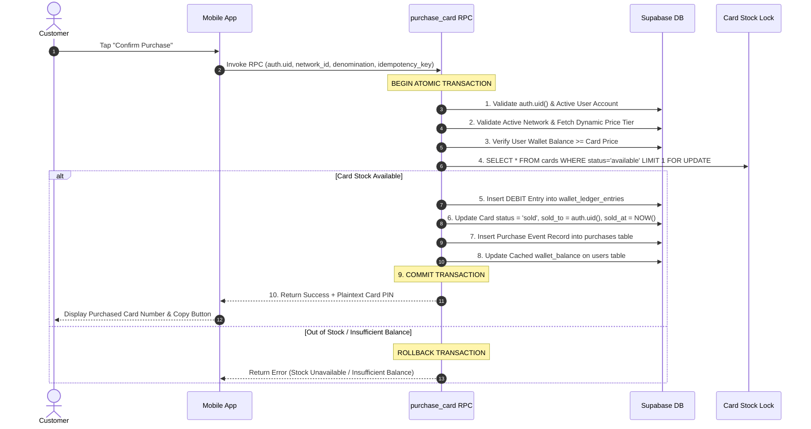

# NETYEMEN FINANCIAL & LEDGER OPERATING CONTRACT (V1.0)

**Task ID:** NY-PRODUCT-001  
**Document Code:** `NETYEMEN-FINANCIAL-OPERATING-CONTRACT-01.md`  
**Classification:** `PROPOSED_CONTRACT`  
**Scope:** Double-Entry Accounting Rules, Financial Invariants, Purchase Atomicity, and Reconciliation  

---

## Implementation status (2026-10-08)

> This section records what the code in `supabase/migrations` (up to
> `20261008094000`) actually does where it differs from, or is narrower than,
> the proposed contract below. The contract text itself is unchanged. Operator
> procedures are in [OPERATIONS-RUNBOOK.md](OPERATIONS-RUNBOOK.md).

| Topic | Contract below | Implemented |
|---|---|---|
| Accounting model | "Double-entry" | **Single-entry** customer ledger. `customer_wallet_ledger` (called `wallet_ledger_entries` below) holds one signed movement per event for the customer's wallet only; there are no platform, owner or clearing accounts and no balancing counter-entry. `wallet_accounts.cached_balance` is a cached sum maintained by the trigger `trg_update_wallet_account_balance` on ledger insert. |
| Ledger immutability | Append-only | Enforced since `20261008092000`: `trg_customer_wallet_ledger_append_only` rejects UPDATE and DELETE, a statement trigger rejects TRUNCATE, RLS is SELECT-only and clients have no write grants. Corrections are new compensating entries. `entry_type` allows `CREDIT`, `DEBIT`, `REVERSAL`; refunds are written as `CREDIT`. |
| Non-negative balance | Invariant | `CHECK (cached_balance >= 0)` on the wallet and `CHECK (balance_after >= 0)` on the ledger; `purchase_package` locks the wallet row and refuses with `INSUFFICIENT_BALANCE`; a non-active wallet is refused with `WALLET_FROZEN`. |
| Price authority | Server-side | The debit is always the current package price. The client may pass `p_expected_price`; a mismatch raises `PRICE_CHANGED` instead of charging a different amount. |
| Idempotency | Unique key per event | Unique `(user_id, idempotency_key)` on ledger, deposits and purchases; concurrent calls with one key are serialized by an advisory lock and the second returns `replayed`. A key reused for another package raises `IDEMPOTENCY_KEY_REUSED`. |
| Reconciliation | Daily, automatic, release-blocking | `finance_reconcile_wallets()` exists and returns the wallets whose cached balance differs from the ledger sum (empty = healthy). It is **not scheduled** and raises no alert; someone must run it daily. Card-inventory and owner-payable reconciliation formulas (4.2, 4.3) have no function. |
| Deposit approval | Finance review | Self-review is refused. Dual approval applies when the amount, **or the amount plus the same customer's approvals of the previous 24 hours**, reaches `deposit_dual_approval_threshold()` (50000 YER): the first approval only moves the request to `under_review`, a different reviewer credits. A bank reference is credited once per destination. |
| Refund vs settlement | Net payable formula | A sale refunded before settlement is voided (no line). A sale refunded after it was included or paid produces a refund line with `net_amount = -(owner net)` carrying the commission of the reversed sale; the platform gives up that commission. `total_refunds` is the owner net clawed back and `net_settlement = gross_sales - total_commission - total_refunds`, which can be negative. Batches created before `20261008090000` may contain wrong refund deductions (see the runbook). |
| Settlement control | — | Creator and approver must differ. Draft / ready-for-review batches can be cancelled with a reason. |
| Payout | Settlement payment | **No payout ledger.** "Paid" is the batch status plus a mandatory free-text payment reference stored in `settlement_batches.notes` and in the audit event. The system does not move or verify money and has no adjustment RPC (`total_adjustments` is always 0). |
| Amount types | Integer YER | Whole rials everywhere, nothing is scaled by 100. Wallet balances, ledger amounts and the batch aggregates (`gross_sales`, `total_commission`, `total_refunds`, `net_settlement`) are 32-bit `INTEGER` columns, so a single balance or batch total is limited to 2,147,483,647 YER; exceeding it fails the transaction rather than wrapping. |

---

## 1. Wallet & Double-Entry Accounting Model

To guarantee 100% financial integrity, NetYemen employs an **Append-Only Immutable Ledger Architecture**. Wallet balances are NEVER updated via direct arithmetic modifications on database tables. Every movement of funds is represented by a double-entry or verified single-direction ledger record.

```
+-----------------------------------------------------------------------------------+
|                           IMMUTABLE FINANCIAL LEDGER                              |
+-----------------------------------------------------------------------------------+
|  - id (UUID Primary Key)                                                          |
|  - user_id (UUID Foreign Key to users)                                            |
|  - entry_type (CREDIT | DEBIT | REVERSAL)                                         |
|  - amount (Integer YER Amount > 0)                                                |
|  - balance_after (Integer Cached Post-Transaction Balance)                         |
|  - reference_type (DEPOSIT | PURCHASE | REFUND | SETTLEMENT | ADJUSTMENT)          |
|  - reference_id (UUID Foreign Key to source event table)                          |
|  - idempotency_key (UUID Unique Constraint)                                       |
|  - actor_id (UUID Performing User / Auth ID)                                      |
|  - reason_code (String Audit Categorization)                                      |
|  - created_at (TIMESTAMPTZ Immutable Execution Time)                              |
+-----------------------------------------------------------------------------------+
```

### 1.1 Core Financial Accounting Entities
1. **`wallet_accounts`:** Represents the user's current account state, tracking `user_id`, `currency` (YER), `cached_balance`, and `account_status` (`active`, `frozen`, `closed`).
2. **`wallet_ledger_entries`:** Immutable table storing every individual debit, credit, or reversal transaction.
3. **`CREDIT` Entry:** Increases the customer's wallet balance (e.g., approved deposit, card complaint refund).
4. **`DEBIT` Entry:** Decreases the customer's wallet balance (e.g., successful card purchase).
5. **`REVERSAL` Entry:** A compensating ledger entry created to offset an erroneous or fraudulent prior transaction.
6. **`idempotency_key`:** Unique UUID supplied by the client or generated per business event to prevent duplicate execution during network retries.

---

## 2. Mandatory Financial Invariants

The financial engine MUST strictly maintain the following 6 mathematical and database invariants under all execution conditions:

```text
INVARIANT 1: Wallet Balance Equation
wallet_balance = SUM(CREDIT amounts) - SUM(DEBIT amounts) +/- SUM(REVERSAL amounts)

INVARIANT 2: Non-Negative Wallet Boundary
wallet_balance >= 0 (CHECK constraint enforced at database schema layer)

INVARIANT 3: One Business Event = One Financial Record
idempotency_key UNIQUE constraint prevents duplicate financial entries for identical business events

INVARIANT 4: Purchase Single Debit Rule
Every completed card purchase MUST correspond to exactly ONE DEBIT ledger entry where amount == price

INVARIANT 5: Compensating Refund Rule
Financial refunds MUST issue a new CREDIT ledger entry. Deleting or modifying prior DEBIT entries is forbidden.

INVARIANT 6: Immutability Rule
SQL DELETE and UPDATE permissions are REVOKED on wallet_ledger_entries for ALL database roles.
```

---

## 3. Atomic Purchase Transaction Specification

The card purchase transaction is the core commercial function of NetYemen. To eliminate race conditions, double-charging, and stock overselling (e.g., two users purchasing the last card simultaneously), card purchases MUST execute within a single atomic PostgreSQL database function (`purchase_card`) using `SERIALIZABLE` or `READ COMMITTED` isolation with explicit `FOR UPDATE` row locking.

### 3.1 Step-by-Step 10-Step Transaction Pipeline


```mermaid
sequenceDiagram
    autonumber
    actor Customer
    participant App as Mobile App
    participant RPC as purchase_card RPC
    participant DB as Supabase DB
    participant Lock as Card Stock Lock

    Customer->>App: Tap "Confirm Purchase"
    App->>RPC: Invoke RPC (auth.uid, network_id, denomination, idempotency_key)
    Note over RPC: BEGIN ATOMIC TRANSACTION
    RPC->>DB: 1. Validate auth.uid() & Active User Account
    RPC->>DB: 2. Validate Active Network & Fetch Dynamic Price Tier
    RPC->>DB: 3. Verify User Wallet Balance >= Card Price
    RPC->>Lock: 4. SELECT * FROM cards WHERE status='available' LIMIT 1 FOR UPDATE
    alt Card Stock Available
        RPC->>DB: 5. Insert DEBIT Entry into wallet_ledger_entries
        RPC->>DB: 6. Update Card status = 'sold', sold_to = auth.uid(), sold_at = NOW()
        RPC->>DB: 7. Insert Purchase Event Record into purchases table
        RPC->>DB: 8. Update Cached wallet_balance on users table
        Note over RPC: 9. COMMIT TRANSACTION
        RPC-->>App: 10. Return Success + Plaintext Card PIN
        App-->>Customer: Display Purchased Card Number & Copy Button
    else Out of Stock / Insufficient Balance
        Note over RPC: ROLLBACK TRANSACTION
        RPC-->>App: Return Error (Stock Unavailable / Insufficient Balance)
    end
```

---

## 4. Platform Financial Reconciliation Formulas

Daily automated reconciliation scripts MUST run to verify system financial integrity across customer wallets, card inventory, and network owner settlements.

### 4.1 Daily Customer Wallet Reconciliation Formula
At the end of each operational day (00:00 UTC), the total platform customer liability is reconciled:

$$\text{Opening Wallet Balances} + \text{Approved Deposits} - \text{Completed Purchase Debits} + \text{Approved Refund Credits} \pm \text{Approved Adjustments} = \text{Closing Wallet Balances}$$

$$\sum_{u \in \text{Users}} \text{wallet\_balance}_u \equiv \sum_{e \in \text{Ledger}} \text{entry\_amount}_e$$

---

### 4.2 Card Inventory Reconciliation Formula
For every registered Wi-Fi network, card inventory counts MUST satisfy:

$$\text{Total Imported Valid Cards} = N_{\text{available}} + N_{\text{reserved}} + N_{\text{sold}} + N_{\text{quarantined}} + N_{\text{invalid}} + N_{\text{cancelled}}$$

If $N_{\text{sold}}$ does not match the count of successful purchase ledger records for that network, an inventory discrepancy alert is triggered immediately.

---

### 4.3 Owner Settlement Net Payable Formula
At the end of each payout cycle, the net settlement payable to a Network Owner is calculated as:

$$\text{Net Owner Payable} = \sum \text{Gross Eligible Card Sales} - \text{Platform Commission (e.g., 5\%)} - \sum \text{Customer Refunds} - \sum \text{Prior Adjustments}$$

---

## 5. Discrepancy Handling & Release-Blocking Rules

1. **Automated Audit Alerting:** If any reconciliation formula yields a non-zero discrepancy, the system generates a `CRITICAL_FINANCIAL_DISCREPANCY` alert in the Admin portal.
2. **Settlement Freeze:** Any network owner account associated with an inventory or financial discrepancy is automatically excluded from automated settlement batch processing until reviewed by a `FINANCE_OFFICER`.
3. **Release Blocker:** Deployment of backend migration scripts or database RPC updates MUST be blocked if local or staging environment financial reconciliation tests fail.
