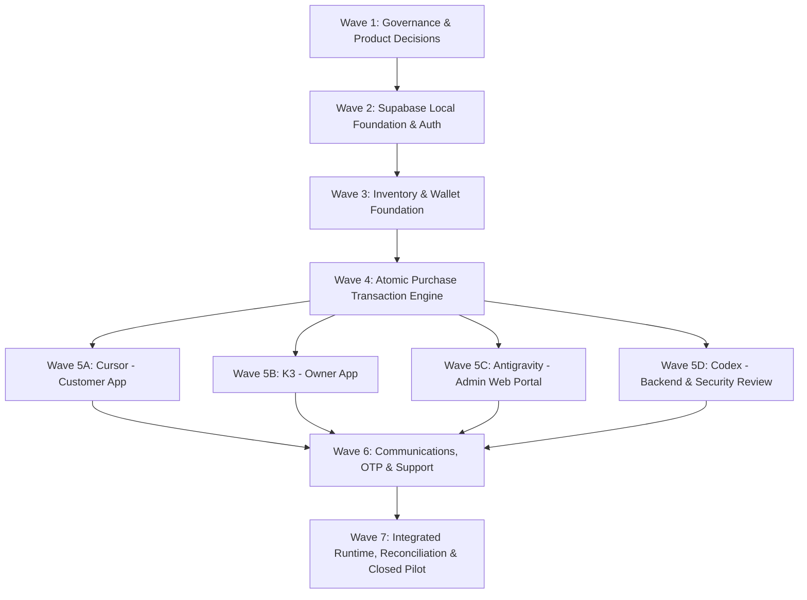

# NETYEMEN MULTI-AGENT IMPLEMENTATION BACKLOG (V1.0)

**Task ID:** NY-PRODUCT-001  
**Document Code:** `NETYEMEN-MULTI-AGENT-IMPLEMENTATION-BACKLOG-01.md`  
**Classification:** `PROPOSED_CONTRACT`  
**Scope:** Multi-Agent Work Allocation, Delivery Waves, Task Backlog, and Merge Sequence  

---

## 1. Agent Ecosystem & Responsibilities

The NetYemen delivery plan coordinates five specialized development and governance agents:

```
+-----------------------------------------------------------------------------------+
|                        MULTI-AGENT DELIVERY ECOSYSTEM                             |
+-----------------------------------------------------------------------------------+
|  1. HUMAN APPROVAL (Product Lead & Security Officer)                             |
|     - Approves Open Decisions, Role Matrix, Production Merges                     |
|  2. CODEX (Backend & Database Architecture Specialist)                            |
|     - Supabase SQL Migrations, RLS Policies, Atomic RPCs, DB Infrastructure       |
|  3. CURSOR (Customer Mobile Application Specialist)                               |
|     - Customer Flutter Android App, Wallet UI, Purchase Flow, Card Reveal         |
|  4. K3 / KIMI CODE (Network Owner Mobile Application Specialist)                  |
|     - Network Owner Flutter Android App, Batch Import Parser, Sales Dashboard     |
|  5. ANTIGRAVITY (Admin Web & Independent Security Reviewer)                       |
|     - React/Vite Admin Web Portal, End-to-End Audits, Security Automation         |
+-----------------------------------------------------------------------------------+
```

---

## 2. Multi-Wave Delivery Sequencing & Dependency Graph



---

## 3. Wave Breakdown & Detailed Task Specifications

### 3.1 Wave 1 — Product Decisions & Architecture Baseline
*Dependencies:* None.  
*Execution Mode:* Sequential Governance.

#### NY-GOV-001: Open Decisions Sign-off & Architecture Approval
* **Task ID:** `NY-GOV-001`
* **Title:** Final Approval of Open Business Decisions & Technology Stack
* **Primary Owner:** `Human Approval`
* **Reviewers:** `Antigravity`, `Codex`
* **Dependencies:** `NY-PRODUCT-001` (This Contract)
* **Allowed Files:** `docs/NETYEMEN-DECISION-REGISTER-01.md`
* **Forbidden Files:** All source code files (`lib/`, `sql/`, `android/`)
* **Database Impact:** None.
* **Production Impact:** None.
* **Acceptance Criteria:** Human product lead approves provisional recommendations for `OD-AUTH-01` through `OD-NOTIF-01`.
* **Positive Tests:** Document review pass.
* **Negative Tests:** Block execution if any blocking open decision remains unresolved.
* **Rollback Strategy:** Revert decision status to `OPEN_DECISION`.
* **PR Size Expectation:** Small (Documentation metadata update).
* **Merge Order:** Merge Sequence 001.

---

### 3.2 Wave 2 — Supabase Local Foundation & Authorization Rules
*Dependencies:* Wave 1 complete.  
*Execution Mode:* Sequential Backend Baseline.

#### NY-BE-001: Supabase Local Migration & Schema Baseline
* **Task ID:** `NY-BE-001`
* **Title:** Database Schema Definition & Core Profile Tables Migration
* **Primary Owner:** `Codex`
* **Reviewers:** `Antigravity`
* **Dependencies:** `NY-GOV-001`
* **Allowed Files:** `supabase/migrations/`, `sql/`
* **Forbidden Files:** `lib/`, `android/`, `test/`
* **Database Impact:** Creates `users`, `networks`, `network_prices`, `roles` tables.
* **Production Impact:** Zero (Local CLI / Staging environment only).
* **Acceptance Criteria:** SQL migrations run cleanly on local Supabase instance (`supabase db reset`).
* **Positive Tests:** `supabase migration up` succeeds; table schema matches specs.
* **Negative Tests:** Database trigger fails if non-normalized phone format supplied.
* **Rollback Strategy:** `supabase db reset` to baseline.
* **PR Size Expectation:** Medium (~ 300 lines SQL).
* **Merge Order:** Merge Sequence 002.

#### NY-BE-002: Default-Deny RLS Policies & Role Authorization Framework
* **Task ID:** `NY-BE-002`
* **Title:** PostgreSQL Row-Level Security & Role Access Policies
* **Primary Owner:** `Codex`
* **Reviewers:** `Antigravity`
* **Dependencies:** `NY-BE-001`
* **Allowed Files:** `supabase/migrations/`
* **Forbidden Files:** `lib/`
* **Database Impact:** Applies `ENABLE ROW LEVEL SECURITY` across 100% of tables.
* **Production Impact:** Zero.
* **Acceptance Criteria:** 8 mandatory anti-bypass rules enforced in SQL policies.
* **Positive Tests:** Users can access own profile rows.
* **Negative Tests:** `NEG-AUTH-001` through `NEG-AUTH-008` pass cleanly.
* **Rollback Strategy:** Revert RLS migration script.
* **PR Size Expectation:** Medium (~ 400 lines SQL).
* **Merge Order:** Merge Sequence 003.

---

### 3.3 Wave 3 — Inventory & Wallet Foundation
*Dependencies:* Wave 2 complete.  
*Execution Mode:* Sequential Backend.

#### NY-BE-003: Card Inventory & Batch Upload Infrastructure
* **Task ID:** `NY-BE-003`
* **Title:** Internet Card Batches & Stock Management Schema
* **Primary Owner:** `Codex`
* **Reviewers:** `K3 / Kimi Code`
* **Dependencies:** `NY-BE-002`
* **Allowed Files:** `supabase/migrations/`
* **Forbidden Files:** `lib/`
* **Database Impact:** Creates `card_batches` and `cards` tables with `pgcrypto` encryption.
* **Production Impact:** Zero.
* **Acceptance Criteria:** Card uniqueness index enforced per network; batch import atomic function created.
* **Positive Tests:** Valid card batch inserts encrypted stock.
* **Negative Tests:** `TEST-CARD-001` (Duplicate card numbers rejected).
* **Rollback Strategy:** Revert migration.
* **PR Size Expectation:** Medium (~ 350 lines SQL).
* **Merge Order:** Merge Sequence 004.

#### NY-BE-004: Immutable Append-Only Financial Ledger & Wallet Schema
* **Task ID:** `NY-BE-004`
* **Title:** Wallet Accounting & Ledger Migration Script
* **Primary Owner:** `Codex`
* **Reviewers:** `Antigravity`
* **Dependencies:** `NY-BE-003`
* **Allowed Files:** `supabase/migrations/`
* **Forbidden Files:** `lib/`
* **Database Impact:** Creates `wallet_accounts`, `wallet_ledger_entries`, `wallet_deposit_requests`.
* **Production Impact:** Zero.
* **Acceptance Criteria:** SQL trigger maintains `wallet_balance` cache; `UPDATE/DELETE` revoked on ledger.
* **Positive Tests:** Ledger credit increases cached balance; deposit request creates pending entry.
* **Negative Tests:** `CHECK (wallet_balance >= 0)` constraint aborts negative balance attempts.
* **Rollback Strategy:** Revert migration.
* **PR Size Expectation:** Medium (~ 400 lines SQL).
* **Merge Order:** Merge Sequence 005.

---

### 3.4 Wave 4 — Atomic Purchase Transaction Engine
*Dependencies:* Wave 3 complete.  
*Execution Mode:* Core Engine Gate (Must merge before Wave 5).

#### NY-BE-005: Atomic Card Purchase RPC Execution Engine
* **Task ID:** `NY-BE-005`
* **Title:** Implementation of Atomic `purchase_card` Database RPC Function
* **Primary Owner:** `Codex`
* **Reviewers:** `Antigravity`, `Cursor`
* **Dependencies:** `NY-BE-004`
* **Allowed Files:** `supabase/migrations/`
* **Forbidden Files:** `lib/`
* **Database Impact:** Creates security-definer `purchase_card` RPC with 10-step atomic pipeline.
* **Production Impact:** Zero.
* **Acceptance Criteria:** 10-step atomic purchase pipeline executed inside PostgreSQL transaction block with `FOR UPDATE` lock.
* **Positive Tests:** Valid purchase debits balance, marks card sold, returns decrypted PIN.
* **Negative Tests:** `TEST-CONCURRENCY-001` (Last card race condition test passes).
* **Rollback Strategy:** Drop `purchase_card` RPC function.
* **PR Size Expectation:** Medium (~ 250 lines SQL).
* **Merge Order:** Merge Sequence 006.

---

### 3.5 Wave 5 — Parallel Application Development
*Dependencies:* Wave 4 complete.  
*Execution Mode:* **PARALLEL EXECUTION** (Cursor, K3, Antigravity, Codex work concurrently in separate workspaces).

#### NY-CUST-001: Customer Android App Redesign & Wallet Integration
* **Task ID:** `NY-CUST-001`
* **Title:** Customer Mobile Client Refactoring & Complete Wallet / Purchase Integration
* **Primary Owner:** `Cursor`
* **Reviewers:** `Antigravity`
* **Dependencies:** `NY-BE-005`
* **Allowed Files:** `lib/screens/`, `lib/models/`, `lib/providers/`, `lib/services/`
* **Forbidden Files:** `sql/`, `supabase/`, `admin/`
* **Database Impact:** None (Invokes RPCs).
* **Production Impact:** Zero.
* **Acceptance Criteria:** Customer app implements dynamic prices, wallet deposit request UI, atomic purchase confirmation modal, and purchaser-only card PIN reveal.
* **Positive Tests:** Customer completes end-to-end card purchase on emulator.
* **Negative Tests:** App displays friendly error on insufficient balance or stock exhaustion.
* **Rollback Strategy:** Revert Dart commits.
* **PR Size Expectation:** Large (~ 1,200 lines Dart).
* **Merge Order:** Merge Sequence 007 (Parallel branch).

#### NY-OWNER-001: Network Owner Android Application Baseline
* **Task ID:** `NY-OWNER-001`
* **Title:** Network Owner App Initialization, Batch Import & Sales Dashboard
* **Primary Owner:** `K3 / Kimi Code`
* **Reviewers:** `Antigravity`
* **Dependencies:** `NY-BE-005`
* **Allowed Files:** `owner_app/` (or dedicated owner codebase folder)
* **Forbidden Files:** `lib/`, `admin/`
* **Database Impact:** None (Invokes RPCs).
* **Production Impact:** Zero.
* **Acceptance Criteria:** Network owners can register, manage price tiers, preview/import CSV card batches, and view sales summaries.
* **Positive Tests:** Owner imports valid CSV card batch cleanly.
* **Negative Tests:** Duplicate lines flagged and rejected during pre-import validation.
* **Rollback Strategy:** Revert owner app directory.
* **PR Size Expectation:** Large (~ 1,500 lines Dart).
* **Merge Order:** Merge Sequence 008 (Parallel branch).

#### NY-ADMIN-001: Administration Web Portal (React / Vite)
* **Task ID:** `NY-ADMIN-001`
* **Title:** Admin & Finance Web Application Development
* **Primary Owner:** `Antigravity`
* **Reviewers:** `Human Approval`
* **Dependencies:** `NY-BE-005`
* **Allowed Files:** `admin_web/`
* **Forbidden Files:** `lib/`, `owner_app/`
* **Database Impact:** None.
* **Production Impact:** Zero.
* **Acceptance Criteria:** Web portal supports owner onboarding review, deposit proof verification queue, purchase monitoring, and settlement calculation.
* **Positive Tests:** Finance Officer approves pending deposit; wallet credited instantly.
* **Negative Tests:** Non-admin role denied access to admin Web portal.
* **Rollback Strategy:** Revert `admin_web/` folder.
* **PR Size Expectation:** Large (~ 2,000 lines TypeScript/React).
* **Merge Order:** Merge Sequence 009 (Parallel branch).

#### NY-SEC-001: Independent Security Review & Pen-Testing Suite
* **Task ID:** `NY-SEC-001`
* **Title:** Backend Security Audit & Automated Pen-Testing Harness
* **Primary Owner:** `Codex`
* **Reviewers:** `Antigravity`
* **Dependencies:** `NY-BE-005`
* **Allowed Files:** `test/security/`
* **Forbidden Files:** Application source code
* **Database Impact:** None.
* **Production Impact:** Zero.
* **Acceptance Criteria:** Automated test script executes all 30 threat model checks and 8 negative authorization tests.
* **Positive Tests:** Security test harness passes 100% of RLS and RPC security assertions.
* **Negative Tests:** Attempted IDOR and price tampering requests fail with HTTP 403.
* **Rollback Strategy:** Remove test harness scripts.
* **PR Size Expectation:** Medium (~ 500 lines test code).
* **Merge Order:** Merge Sequence 010 (Parallel branch).

---

### 3.6 Wave 6 — Communications, OTP & Support Workflows
*Dependencies:* Wave 5 parallel tasks complete.  
*Execution Mode:* Integration Convergence.

#### NY-BE-006: SMS Gateway & FCM Push Notification Services
* **Task ID:** `NY-BE-006`
* **Title:** Edge Functions for ALAWAEL SMS OTP & FCM Push Notifications
* **Primary Owner:** `Codex`
* **Reviewers:** `Cursor`, `Antigravity`
* **Dependencies:** `NY-CUST-001`, `NY-ADMIN-001`
* **Allowed Files:** `supabase/functions/`
* **Forbidden Files:** `lib/`
* **Database Impact:** None.
* **Production Impact:** Zero.
* **Acceptance Criteria:** Supabase Edge Functions trigger ALAWAEL SMS for OTPs and dispatch FCM push alerts on deposit approval and card purchase.
* **Positive Tests:** SMS OTP dispatched within 3 seconds; push alert arrives on deposit approval.
* **Negative Tests:** Notification failure does not abort committed database transactions (`TEST-RECOVERY-001`).
* **Rollback Strategy:** Disable Edge Function webhooks.
* **PR Size Expectation:** Medium (~ 350 lines TS).
* **Merge Order:** Merge Sequence 011.

---

### 3.7 Wave 7 — Integrated Runtime, Reconciliation & Closed Pilot
*Dependencies:* Wave 6 complete.  
*Execution Mode:* Final Release Qualification Gate.

#### NY-REL-001: Closed Pilot Deployment & Final Quality Audit
* **Task ID:** `NY-REL-001`
* **Title:** System End-to-End Verification & Staging Release Gate
* **Primary Owner:** `Antigravity`
* **Reviewers:** `Human Approval`
* **Dependencies:** All prior tasks
* **Allowed Files:** `docs/`
* **Forbidden Files:** Production code
* **Database Impact:** Zero.
* **Production Impact:** Staging deployment verification.
* **Acceptance Criteria:** 100% of 64 acceptance tests pass; zero financial discrepancies; human approval sign-off.
* **Positive Tests:** Complete customer journey executed cleanly on staging environment.
* **Negative Tests:** Zero critical security findings or RLS bypasses.
* **Rollback Strategy:** Abort staging release candidate.
* **PR Size Expectation:** Small (Final audit report).
* **Merge Order:** Merge Sequence 012 (Final Release Candidate).
