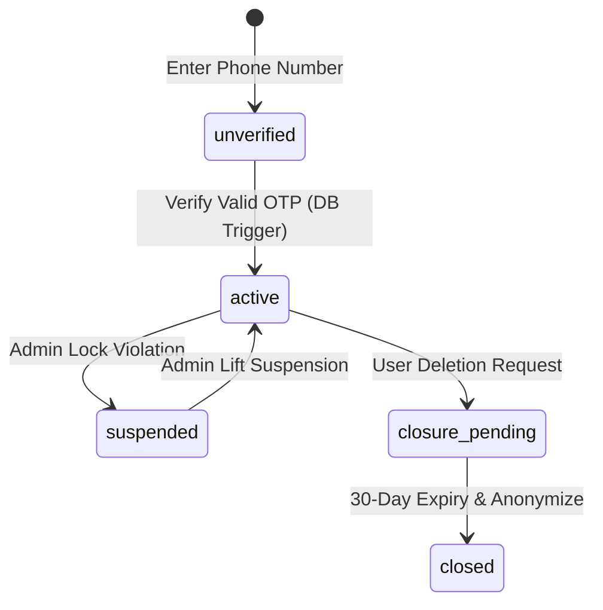
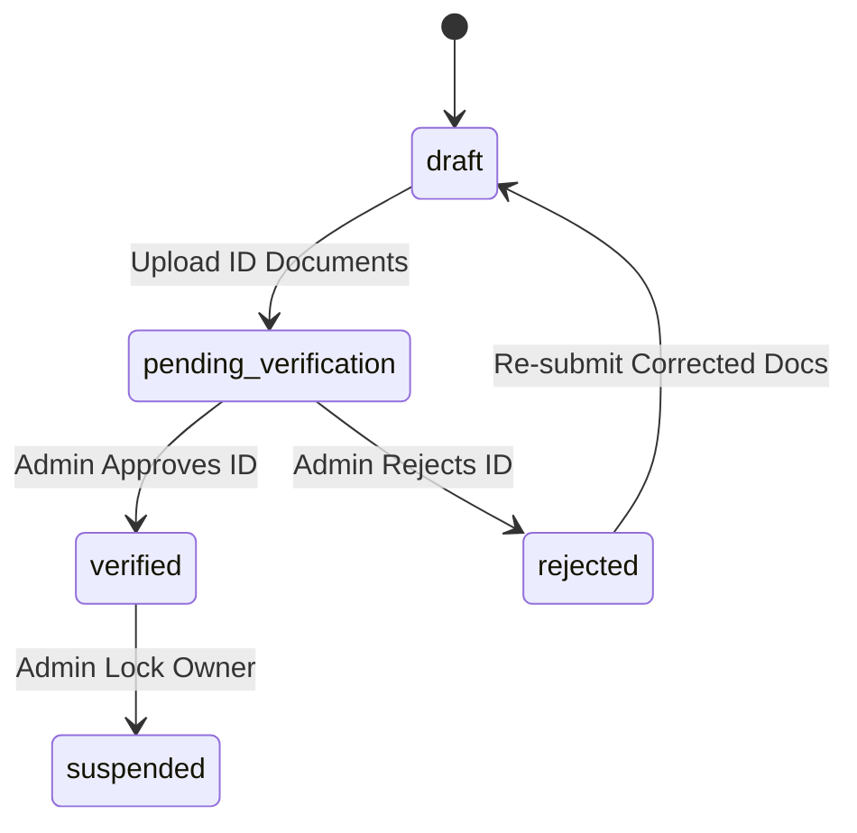
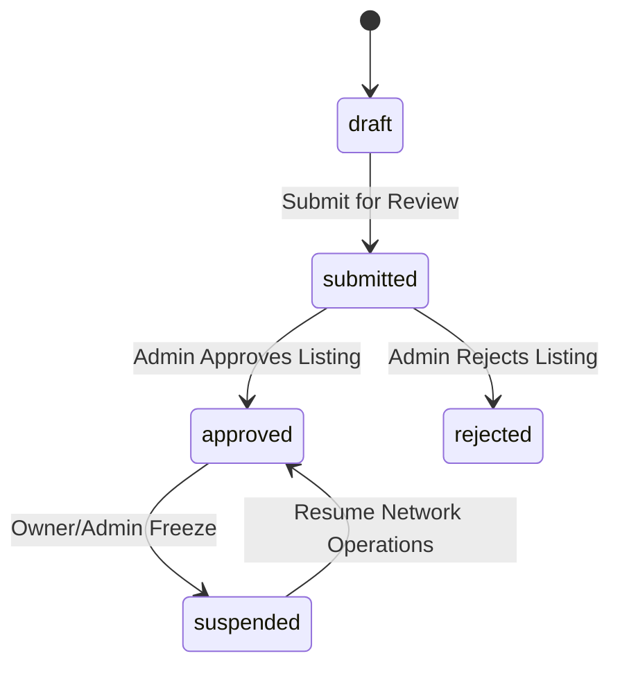
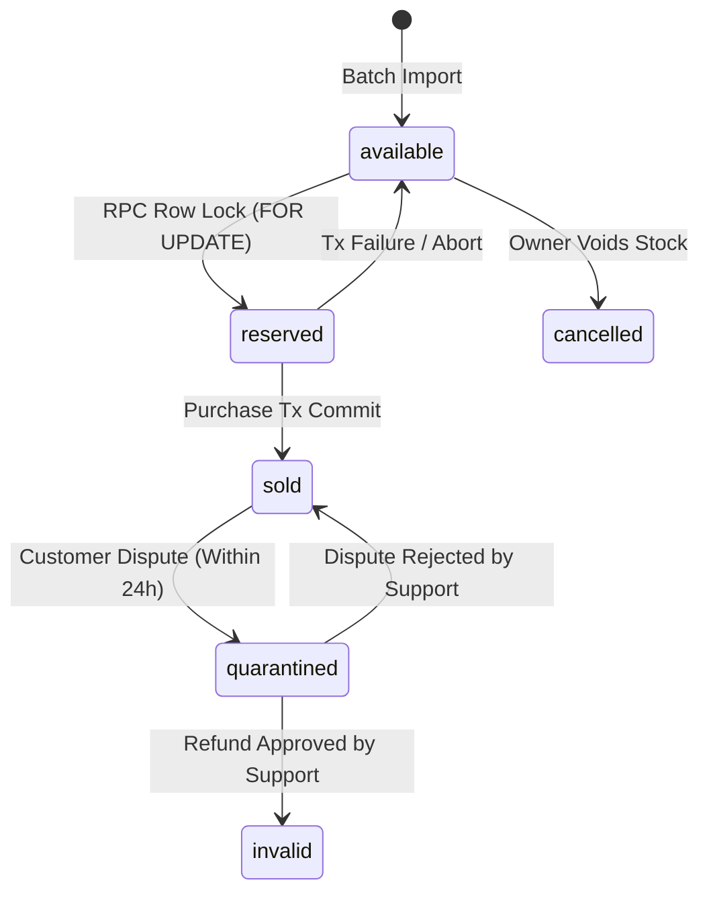
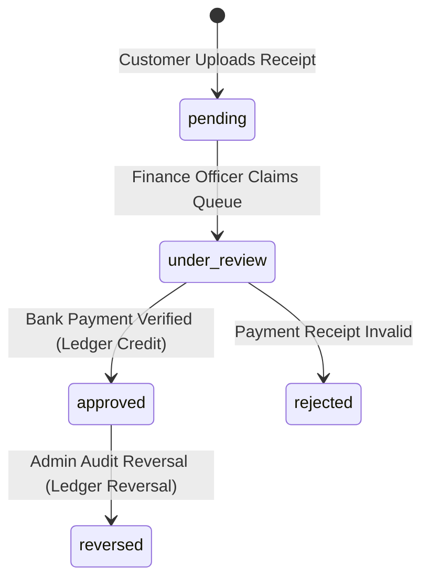
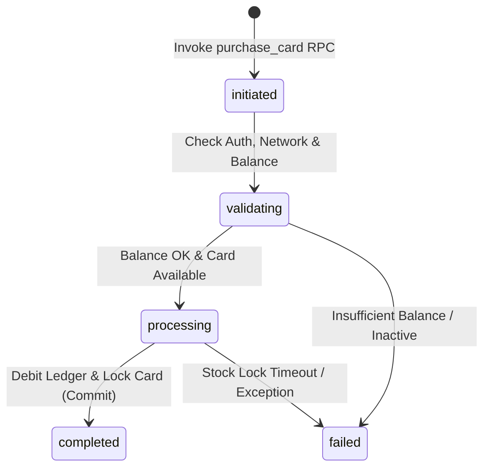
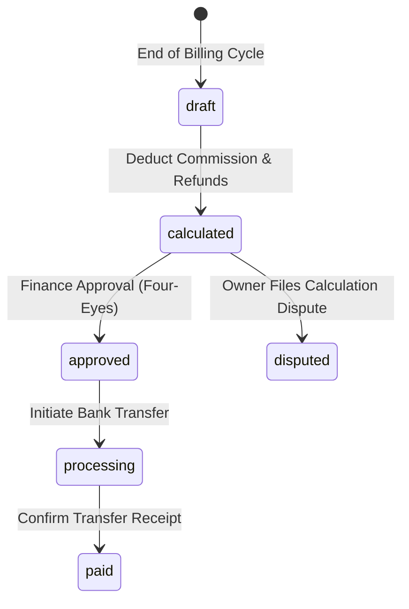
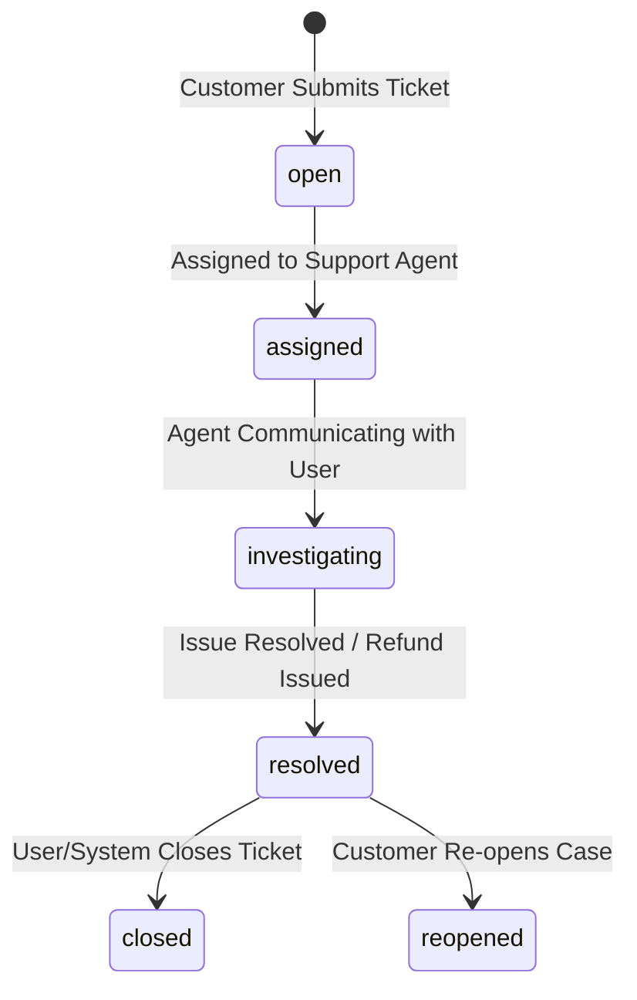

# NETYEMEN WORKFLOW STATE MACHINES (V1.0)

**Task ID:** NY-PRODUCT-001  
**Document Code:** `NETYEMEN-WORKFLOW-STATE-MACHINES-01.md`  
**Classification:** `PROPOSED_CONTRACT`  
**Scope:** Core Domain Entity Lifecycle Specifications and Transition Logic  

---

## 1. Customer Account Lifecycle State Machine

### 1.1 States
* `unverified`: Phone number entered; awaiting OTP verification.
* `active`: Account verified; full access to marketplace, wallet, and purchases.
* `suspended`: Account temporarily locked due to security flag or administrative action.
* `closure_pending`: Account deletion requested; awaiting financial settlement grace period.
* `closed`: Account closed; PII anonymized; historical ledger retained for compliance.

### 1.2 Transition Matrix

| Current State | Event / Trigger | Triggering Actor | Target State | Pre-conditions | Database & Ledger Side Effects |
|---|---|---|---|---|---|
| `[None]` | Submit Phone | Guest User | `unverified` | Valid Yemen phone format | Issue OTP token log |
| `unverified` | Verify Valid OTP | Guest User | `active` | Valid unexpired OTP | Trigger creates `users` record (`wallet_balance=0`) |
| `active` | Administrative Lock | `PLATFORM_ADMIN` | `suspended` | Documented reason code | Revoke active JWT session tokens |
| `suspended` | Administrative Lift | `PLATFORM_ADMIN` | `active` | Violation resolved | Restore login access; log audit event |
| `active` | Request Deletion | Verified Customer | `closure_pending` | Zero outstanding disputes | Flag account deletion timestamp |
| `closure_pending`| Grace Period Expired | System Worker | `closed` | 30 days elapsed; balance = 0 | Anonymize `full_name` & PII; retain ledger |

### 1.3 Forbidden Transitions (`FORBIDDEN_BEHAVIOR`)
* Direct transition from `unverified` to `suspended` or `closed`.
* Transition from `closed` back to `active` (Requires new phone registration).

### 1.4 State Diagram

---

## 2. Network Owner Verification & Onboarding State Machine

### 2.1 States
* `draft`: Owner profile created; identity details incomplete.
* `pending_verification`: Identity documents uploaded; awaiting Admin verification review.
* `verified`: Commercial identity verified by Admin; owner permitted to create networks.
* `rejected`: Verification rejected due to invalid documents.
* `suspended`: Owner account locked due to fraud or compliance violation.

### 2.2 Transition Matrix

| Current State | Event / Trigger | Triggering Actor | Target State | Pre-conditions | Database & Ledger Side Effects |
|---|---|---|---|---|---|
| `draft` | Submit Identity Files | Network Owner | `pending_verification` | ID image & details complete | Create onboarding review task in Admin Web |
| `pending_verification` | Approve Documents | `PLATFORM_ADMIN` | `verified` | Documents verified | Set `owner_status = 'verified'` |
| `pending_verification` | Reject Documents | `PLATFORM_ADMIN` | `rejected` | Document mismatch | Log rejection reason; send customer push/SMS |
| `verified` | Security Suspension | `PLATFORM_ADMIN` | `suspended` | Fraud alert or breach | Deactivate all owned networks (`is_active=false`) |

### 2.3 State Diagram

---

## 3. Network Approval State Machine

### 3.1 States
* `draft`: Network details entered by owner; not submitted for review.
* `submitted`: Submitted for platform listing approval.
* `approved`: Approved by Admin; active for public discovery and card sales.
* `rejected`: Rejected by Admin (e.g., duplicate network name, invalid coverage).
* `suspended`: Suspended by Admin or Owner (sales halted).

### 3.2 Transition Matrix

| Current State | Event / Trigger | Triggering Actor | Target State | Pre-conditions | Database & Ledger Side Effects |
|---|---|---|---|---|---|
| `draft` | Submit Network | Network Owner | `submitted` | Owner status = `verified` | Create network approval queue item |
| `submitted` | Approve Listing | `PLATFORM_ADMIN` | `approved` | Location & details verified | Set `is_approved = true`, `is_active = true` |
| `submitted` | Reject Listing | `PLATFORM_ADMIN` | `rejected` | Invalid SSID/Location | Set `is_approved = false`; log reason |
| `approved` | Freeze Network | Owner / Admin | `suspended` | Operational hold | Set `is_active = false`; block card purchases |
| `suspended` | Resume Network | Owner / Admin | `approved` | Hold resolved | Set `is_active = true`; unfreeze purchases |

### 3.3 State Diagram

---

## 4. Card Inventory State Machine

### 4.1 States
* `available`: Imported and valid; ready for atomic purchase lock.
* `reserved`: Temporarily locked inside active purchase RPC execution (< 5s).
* `sold`: Successfully purchased by customer; card PIN revealed to buyer.
* `quarantined`: Under active complaint investigation post-purchase.
* `invalid`: Confirmed invalid or damaged; excluded from settlement.
* `cancelled`: Voided by owner before sale.

### 4.2 Transition Matrix

| Current State | Event / Trigger | Triggering Actor | Target State | Pre-conditions | Database & Ledger Side Effects |
|---|---|---|---|---|---|
| `[None]` | Import Batch File | Owner / Operator | `available` | Pre-import format pass | Insert card encrypted row (`status='available'`) |
| `available` | Lock Card in RPC | Purchase RPC | `reserved` | `SELECT ... FOR UPDATE` | Hold row lock during purchase RPC |
| `reserved` | Commit Purchase | Purchase RPC | `sold` | Wallet balance deducted | Set `sold_to = auth.uid()`, `sold_at = NOW()` |
| `reserved` | Purchase Aborted | Purchase RPC | `available` | Balance fail or error | Release row lock |
| `sold` | File Complaint | Customer | `quarantined` | Within 24h of purchase | Freeze owner settlement credit for card |
| `quarantined` | Approve Refund | `SUPPORT_AGENT` | `invalid` | PIN confirmed bad | Issue compensating refund credit to buyer |
| `quarantined` | Reject Complaint | `SUPPORT_AGENT` | `sold` | PIN confirmed valid | Release owner settlement hold |
| `available` | Void Stock | Network Owner | `cancelled` | Card unsold | Set `status = 'cancelled'` |

### 4.3 Forbidden Transitions (`FORBIDDEN_BEHAVIOR`)
* Direct transition from `sold` back to `available`.
* Transition from `invalid` or `cancelled` to `sold`.

### 4.4 State Diagram

---

## 5. Wallet Deposit Request State Machine

### 5.1 States
* `pending`: Deposit request created by customer with payment proof attached.
* `under_review`: Claimed by Finance Officer for banking verification.
* `approved`: Payment verified; wallet balance credited via ledger.
* `rejected`: Payment proof invalid or unverified.
* `reversed`: Approved deposit reversed due to bank chargeback or fraud audit.

### 5.2 Transition Matrix

| Current State | Event / Trigger | Triggering Actor | Target State | Pre-conditions | Database & Ledger Side Effects |
|---|---|---|---|---|---|
| `[None]` | Submit Deposit | Verified Customer | `pending` | Amount > 0 & Receipt image | Create `wallet_deposit_requests` row |
| `pending` | Claim Review | `FINANCE_OFFICER` | `under_review` | Finance session active | Lock review queue item |
| `under_review` | Confirm Bank Receipt| `FINANCE_OFFICER` | `approved` | Bank reference matches | Insert `CREDIT` row into `wallet_ledger_entries` |
| `under_review` | Reject Proof | `FINANCE_OFFICER` | `rejected` | Ref number invalid | Set status `rejected`; log reason; notify user |
| `approved` | Audit Reversal | `PLATFORM_ADMIN` | `reversed` | Bank transfer cancelled | Insert `REVERSAL` debit into ledger |

### 5.3 State Diagram

---

## 6. Card Purchase Transaction State Machine

### 6.1 States
* `initiated`: Client invokes `purchase_card` RPC with network ID & price tier.
* `validating`: RPC validates user account status, active network, and wallet balance.
* `processing`: RPC locks card stock (`FOR UPDATE`) and inserts ledger debit.
* `completed`: Atomic transaction committed; card status `sold`; PIN returned.
* `failed`: Transaction rolled back due to insufficient balance, out-of-stock, or lock timeout.

### 6.2 State Diagram

---

## 7. Owner Settlement State Machine

### 7.1 States
* `draft`: Calculated eligible net payout for active billing cycle.
* `calculated`: Net payable finalized post commission and refund deductions.
* `approved`: Payout voucher approved by Finance Officer / Admin.
* `processing`: Bank payout transfer initiated.
* `paid`: Payout confirmed transferred; transaction closed.
* `disputed`: Owner disputed settlement calculations.

### 7.2 State Diagram

---

## 8. Support Ticket & Card Complaint State Machines

### 8.1 Support Ticket Lifecycle

