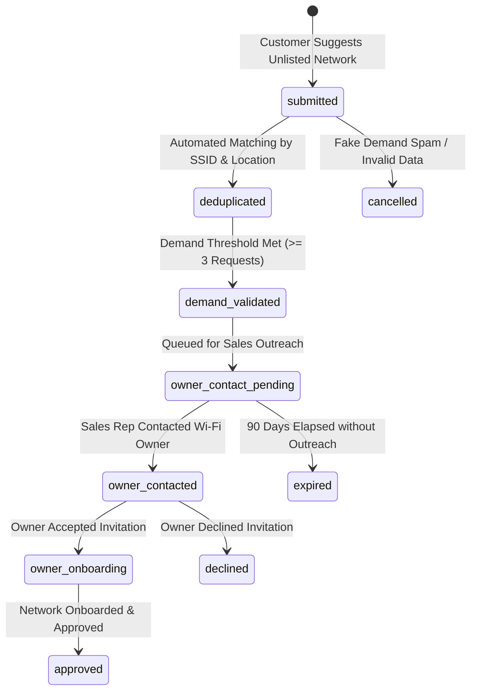

# NETYEMEN WORKFLOW STATE MACHINES (V1.0 + V1.1 REMEDIATED)

**Task ID:** NY-PRODUCT-001F  
**Document Code:** `NETYEMEN-WORKFLOW-STATE-MACHINES-01.md`  
**Classification:** `PROPOSED_CONTRACT`  
**Scope:** Complete Workflow Lifecycle Specifications for All Domain Entities  

---

## 0. Customer Account Lifecycle State Machine (User Persona)

### 0.1 States
* `unverified`: Phone number entered; awaiting OTP verification.
* `active`: Account verified; full access to marketplace, wallet, and purchases.
* `suspended`: Account temporarily locked due to security flag or administrative action.
* `closure_pending`: Account deletion requested; 30-day financial reconciliation grace period active.
* `closed`: Account closed; PII anonymized; historical ledger retained per retention policy (`OD-PRIV-01`).

### 0.2 Transition Specification
* **Allowed Transitions:** `unverified` -> `active` -> `suspended` -> `active`, `active` -> `closure_pending` -> `closed`.
* **Forbidden Transitions:** Direct jump `unverified` -> `suspended`; `closed` -> `active`.
* **Authorized Actor:** Self Customer (`auth.uid()`) for registration/deletion; `PLATFORM_ADMIN` for suspension.
* **Terminal States:** `closed`.

---

## 1. Owner Onboarding Workflow State Machine

### 1.1 State Definitions
* `draft`: Owner profile created; commercial identity details incomplete.
* `pending_verification`: Commercial identity files uploaded; awaiting Admin verification review.
* `verified`: Commercial identity verified by Admin; owner permitted to list networks.
* `rejected`: Verification rejected due to invalid or unreadable identity documents.
* `suspended`: Owner account locked due to security violation or fraud alert.

### 1.2 Full Transition Specification
* **Allowed Transitions:** `draft` -> `pending_verification` -> `verified` / `rejected`; `verified` -> `suspended` -> `verified`; `rejected` -> `draft`.
* **Forbidden Transitions:** `draft` -> `verified` (bypassing review); `suspended` -> `draft`.
* **Authorized Actor:** Owner for submit; `PLATFORM_ADMIN` for approve/reject/suspend.
* **Required Evidence:** Valid Commercial Registration or National ID photo upload.
* **Side Effects:** Transition to `verified` grants owner dashboard permissions; `suspended` deactivates all owned networks (`is_active = false`).
* **Audit Event:** `OWNER_ONBOARDING_STATUS_CHANGED`.
* **Idempotency Behavior:** Resubmitting verification docs in `pending_verification` updates queue item without duplicate account creation.
* **Cancellation Behavior:** Owner may cancel `draft` profile at any time.
* **Failure Recovery:** Rejection allows owner to re-upload corrected documents (`rejected` -> `draft`).
* **Direct RPC Authorization Expectations:** Direct REST/RPC calls to set `owner_status = 'verified'` fail RLS unless caller is `PLATFORM_ADMIN`.
* **Terminal States:** `suspended` (indefinite until resolved).
* **Reopen Rules:** Admin may lift suspension (`suspended` -> `verified`).

---

## 2. Network Approval Workflow State Machine

### 2.1 State Definitions
* `draft`: Network details entered by owner; not submitted for review.
* `submitted`: Submitted for platform listing approval.
* `under_review`: Claimed by Admin for coverage & location verification.
* `approved`: Approved by Admin; active for public discovery and card sales.
* `rejected`: Rejected by Admin (e.g., duplicate SSID, invalid location).
* `suspended`: Temporarily frozen by Owner or Admin (sales halted).
* `deactivated`: Permanently deactivated network.

### 2.2 Full Transition Specification
* **Allowed Transitions:** `draft` -> `submitted` -> `under_review` -> `approved` / `rejected`; `approved` -> `suspended` -> `approved`; `approved` / `suspended` -> `deactivated`.
* **Forbidden Transitions:** `draft` -> `approved` (bypassing admin approval); `deactivated` -> `approved`.
* **Authorized Actor:** Network Owner for submit/freeze; `PLATFORM_ADMIN` for approve/reject/deactivate.
* **Required Evidence:** Valid SSID list, Governorate/City location coordinates, active owner profile.
* **Side Effects:** `approved` sets `is_approved = true, is_active = true`; `suspended` freezes ongoing card purchases.
* **Audit Event:** `NETWORK_APPROVAL_STATUS_CHANGED`.
* **Idempotency Behavior:** Duplicate approval calls return current network state.
* **Cancellation Behavior:** Owner may cancel `submitted` listing before `under_review`.
* **Failure Recovery:** Rejection allows owner to edit details and re-submit.
* **Direct RPC Authorization Expectations:** RLS denies non-admin update to `is_approved`.
* **Terminal States:** `deactivated`.
* **Reopen Rules:** `suspended` can transition to `approved`; `deactivated` cannot be reopened.

---

## 3. Wallet Deposit Request Workflow State Machine

### 3.1 State Definitions
* `pending`: Deposit request submitted by customer with payment receipt attached.
* `under_review`: Claimed by Finance Officer for bank reference verification.
* `approved`: Bank reference confirmed in official bank portal; wallet credited via ledger.
* `rejected`: Payment proof invalid, unverified, or duplicate.
* `reversed`: Approved deposit reversed due to chargeback or audit finding.

### 3.2 Full Transition Specification
* **Allowed Transitions:** `pending` -> `under_review` -> `approved` / `rejected`; `approved` -> `reversed`.
* **Forbidden Transitions:** `pending` -> `approved` (bypassing review); `rejected` -> `approved`.
* **Authorized Actor:** Customer for submit; `FINANCE_OFFICER` for approve/reject; `PLATFORM_ADMIN` for reversal.
* **Required Evidence:** Receipt screenshot image upload & bank transaction reference number.
* **Side Effects:** `approved` inserts `CREDIT` row into `wallet_ledger_entries` and updates cached balance.
* **Audit Event:** `WALLET_DEPOSIT_STATUS_CHANGED`.
* **Idempotency Behavior:** Unique constraint on `reference_number` prevents duplicate deposit submissions.
* **Cancellation Behavior:** Customer may cancel `pending` request before `under_review`.
* **Failure Recovery:** Rejection notifies customer with explicit reason code.
* **Direct RPC Authorization Expectations:** RLS restricts deposit approval to `FINANCE_OFFICER` role.
* **Terminal States:** `rejected`, `reversed`.
* **Reopen Rules:** Rejected deposits cannot be reopened; customer must submit a new request with valid proof.

---

## 4. Card Batch Import Workflow State Machine

### 4.1 State Definitions
* `draft`: Batch file uploaded to server session; pending pre-import validation.
* `validating`: Parsing lines, inspecting format, checking duplicate card PINs against DB.
* `imported`: All valid lines committed to `cards` table with column encryption.
* `quarantined`: Batch flagged due to high duplicate/error rate (> 5%).
* `cancelled`: Import aborted by owner or validation failure.

### 4.2 Full Transition Specification
* **Allowed Transitions:** `draft` -> `validating` -> `imported` / `quarantined` / `cancelled`.
* **Forbidden Transitions:** `draft` -> `imported` (bypassing validation); `quarantined` -> `imported` (without admin override).
* **Authorized Actor:** Network Owner / Operator.
* **Required Evidence:** Valid CSV/Text file with format `CardNumber, Denomination`.
* **Side Effects:** `imported` creates encrypted rows in `cards` table (`status = 'available'`).
* **Audit Event:** `CARD_BATCH_IMPORTED`.
* **Idempotency Behavior:** Hash of batch file prevents duplicate accidental double-uploads.
* **Cancellation Behavior:** Owner may cancel during `draft` or `validating`.
* **Failure Recovery:** Validation errors render detailed line error summary for correction.
* **Direct RPC Authorization Expectations:** Security-definer import function verifies owner network assignment.
* **Terminal States:** `imported`, `cancelled`.
* **Reopen Rules:** Quarantined batch requires `PLATFORM_ADMIN` review to release or cancel.

---

## 5. Internet Card Lifecycle Workflow State Machine

### 5.1 State Definitions
* `available`: Valid stock ready for atomic purchase lock.
* `reserved`: Locked inside active `purchase_card` RPC transaction (`FOR UPDATE`).
* `sold`: Purchased by customer; card PIN disclosed exclusively to purchaser.
* `quarantined`: Under dispute investigation post-purchase.
* `invalid`: Confirmed defective/used prior to sale; excluded from owner settlement.
* `cancelled`: Unsold stock voided by network owner.

### 5.2 Full Transition Specification
* **Allowed Transitions:** `available` -> `reserved` -> `sold` / `available` (on RPC rollback); `sold` -> `quarantined` -> `invalid` / `sold`; `available` -> `cancelled`.
* **Forbidden Transitions:** `sold` -> `available`; `invalid` -> `sold`; `cancelled` -> `sold`.
* **Authorized Actor:** Purchase RPC for lock/sell; Customer for dispute; Support Agent for quarantine/invalid.
* **Required Evidence:** Purchase transaction commit; Customer card complaint.
* **Side Effects:** `sold` sets `sold_to = auth.uid()`; `invalid` debits owner settlement hold.
* **Audit Event:** `CARD_STATUS_CHANGED`.
* **Idempotency Behavior:** Unique purchase idempotency key prevents duplicate card allocation.
* **Cancellation Behavior:** Owner can void `available` cards.
* **Failure Recovery:** Transaction rollback releases `reserved` cards back to `available`.
* **Direct RPC Authorization Expectations:** RLS denies direct client updates to `status`.
* **Terminal States:** `invalid`, `cancelled`.
* **Reopen Rules:** `quarantined` dispute rejected returns card status to `sold`.

---

## 6. Purchase RPC Transaction Workflow State Machine

### 6.1 State Definitions
* `initiated`: Client invokes `purchase_card` RPC with parameters.
* `validating`: RPC validates user account status, network active status, and wallet balance.
* `processing`: RPC locks card stock (`FOR UPDATE SKIP LOCKED`) and inserts ledger debit.
* `completed`: Atomic transaction committed; card status `sold`; PIN returned.
* `failed`: Transaction rolled back due to insufficient balance, stock exhaustion, or lock timeout.

### 6.2 Full Transition Specification
* **Allowed Transitions:** `initiated` -> `validating` -> `processing` -> `completed` / `failed`.
* **Forbidden Transitions:** Direct `initiated` -> `completed` bypassing balance/stock locks.
* **Authorized Actor:** Security-Definer PostgreSQL `purchase_card` RPC.
* **Required Evidence:** `auth.uid()`, active network, valid balance >= price, available card lock.
* **Side Effects:** Single atomic commit executes debit, marks card sold, writes purchase log.
* **Audit Event:** `PURCHASE_TRANSACTION_EXECUTED`.
* **Idempotency Behavior:** `idempotency_key` check returns cached completed result if re-submitted.
* **Cancellation Behavior:** Aborts automatically if any validation fails.
* **Failure Recovery:** Rolled back transaction leaves balance and stock unchanged.
* **Direct RPC Authorization Expectations:** RPC enforces `auth.uid()` implicitly; explicit client `user_id` overrides rejected.
* **Terminal States:** `completed`, `failed`.
* **Reopen Rules:** None (Terminal execution).

---

## 7. Refund Request Workflow State Machine

### 7.1 State Definitions
* `submitted`: Card complaint filed by customer within 24 hours of purchase.
* `investigating`: Assigned to Support Agent for verification with network owner.
* `approved_refund`: Complaint validated; compensating wallet credit issued.
* `rejected_dispute`: Complaint rejected (e.g. card PIN confirmed consumed by buyer).

### 7.2 Full Transition Specification
* **Allowed Transitions:** `submitted` -> `investigating` -> `approved_refund` / `rejected_dispute`.
* **Forbidden Transitions:** `submitted` -> `approved_refund` (bypassing investigation).
* **Authorized Actor:** Customer for submit; `SUPPORT_AGENT` for investigate/approve/reject.
* **Required Evidence:** Ticket text explanation & card ID within 24h purchase window.
* **Side Effects:** `approved_refund` inserts `CREDIT` ledger row and quarantines/invalids card.
* **Audit Event:** `REFUND_REQUEST_STATUS_CHANGED`.
* **Idempotency Behavior:** Max 1 open complaint allowed per purchase ID.
* **Cancellation Behavior:** Customer may withdraw complaint before investigation complete.
* **Failure Recovery:** Rejection leaves purchase intact; user notified.
* **Direct RPC Authorization Expectations:** RLS restricts refund execution to `SUPPORT_AGENT` role.
* **Terminal States:** `approved_refund`, `rejected_dispute`.
* **Reopen Rules:** Customer may appeal rejection once with additional evidence (`rejected_dispute` -> `investigating`).

---

## 8. Owner Settlement Workflow State Machine

### 8.1 State Definitions
* `draft`: Calculated net payout statement for billing cycle.
* `calculated`: Net payable finalized post commission and refund deductions.
* `approved`: Settlement voucher approved by Finance Officer / Admin.
* `processing`: Bank payout transfer initiated.
* `paid`: Payout confirmed transferred; transaction closed.
* `disputed`: Owner disputed settlement calculation.

### 8.2 Full Transition Specification
* **Allowed Transitions:** `draft` -> `calculated` -> `approved` -> `processing` -> `paid`; `calculated` -> `disputed` -> `calculated`.
* **Forbidden Transitions:** `draft` -> `paid` (bypassing approval).
* **Authorized Actor:** System job for draft; `FINANCE_OFFICER` for calculate/approve; Owner for dispute.
* **Required Evidence:** Sales summary logs, commission deduction calculation, bank transfer reference.
* **Side Effects:** `paid` marks billing cycle closed and generates payout voucher record.
* **Audit Event:** `SETTLEMENT_STATUS_CHANGED`.
* **Idempotency Behavior:** Billing cycle settlement voucher created exactly once per cycle.
* **Cancellation Behavior:** Disputed calculations hold payout processing.
* **Failure Recovery:** Transfer failure in `processing` reverts status to `approved` for retry.
* **Direct RPC Authorization Expectations:** RLS restricts settlement voucher creation to `FINANCE_OFFICER`.
* **Terminal States:** `paid`.
* **Reopen Rules:** `disputed` returns voucher to `calculated` state for adjustment.

---

## 9. Support Ticket Workflow State Machine

### 9.1 State Definitions
* `open`: Ticket submitted by customer.
* `assigned`: Claimed by or assigned to Support Agent.
* `investigating`: Agent actively communicating with user and investigating logs.
* `resolved`: Resolution provided to customer.
* `closed`: Ticket closed after confirmation or timeout.
* `reopened`: Customer re-opens resolved ticket within 48 hours.

### 9.2 Full Transition Specification
* **Allowed Transitions:** `open` -> `assigned` -> `investigating` -> `resolved` -> `closed`; `resolved` -> `reopened` -> `investigating`.
* **Forbidden Transitions:** `open` -> `closed` (without agent response).
* **Authorized Actor:** Customer for submit/reopen; `SUPPORT_AGENT` for assign/investigate/resolve.
* **Required Evidence:** Support request context.
* **Side Effects:** Assigned ticket context allows agent restricted card PIN inspection.
* **Audit Event:** `SUPPORT_TICKET_STATUS_CHANGED`.
* **Idempotency Behavior:** Duplicate ticket submissions grouped by customer.
* **Cancellation Behavior:** Customer may close ticket at any time.
* **Failure Recovery:** Reopened tickets return to active agent queue.
* **Direct RPC Authorization Expectations:** Support agent access scoped to assigned tickets.
* **Terminal States:** `closed`.
* **Reopen Rules:** Allowed within 48 hours of resolution.

---

## 10. Network-Addition Request Workflow State Machine (NY-PRODUCT-001F Approved States)

### 10.1 State Definitions
* `submitted`: Customer submits "Suggest New Network" lead in app.
* `deduplicated`: Lead aggregated with existing requests for the same SSID / locality.
* `demand_validated`: Lead demand threshold met (e.g. >= 3 customer requests for location).
* `owner_contact_pending`: Queued for sales representative outreach.
* `owner_contacted`: Sales representative reached out to local Wi-Fi owner.
* `owner_onboarding`: Owner accepted invitation and began registration.
* `approved`: Network onboarded and listed on platform.
* `declined`: Owner declined platform listing invitation.
* `expired`: Lead expired after 90 days without owner contact.
* `cancelled`: Lead voided due to invalid SSID or fake demand spam.

### 10.2 Full Transition Specification

* **Allowed Transitions:** `submitted` -> `deduplicated` -> `demand_validated` -> `owner_contact_pending` -> `owner_contacted` -> `owner_onboarding` -> `approved`; `owner_contacted` -> `declined`; `owner_contact_pending` -> `expired`; `submitted` / `deduplicated` -> `cancelled`.
* **Forbidden Transitions:** `submitted` -> `approved` (bypassing onboarding); `declined` -> `approved`.
* **Authorized Actor:** Customer for submit; System for deduplicate; `PLATFORM_ADMIN` / Sales Rep for outreach/onboarding.
* **Required Evidence:** SSID name, City, District. Requester identity is anonymized and NEVER disclosed to network owner.
* **Side Effects:** `approved` converts lead into active platform network.
* **Audit Event:** `NETWORK_ADDITION_LEAD_STATUS_CHANGED`.
* **Idempotency Behavior:** Duplicate SSID submissions from same user rate-limited (1 request per SSID per 30 days).
* **Cancellation Behavior:** Admin may mark fake/spam leads as `cancelled`.
* **Failure Recovery:** Declined leads logged for future re-engagement.
* **Direct RPC Authorization Expectations:** Customer insert allowed via RLS; lead status updates restricted to `PLATFORM_ADMIN`.
* **Terminal States:** `approved`, `declined`, `expired`, `cancelled`.
* **Reopen Rules:** `expired` leads may be reactivated if new customer demand is registered (`expired` -> `demand_validated`).
