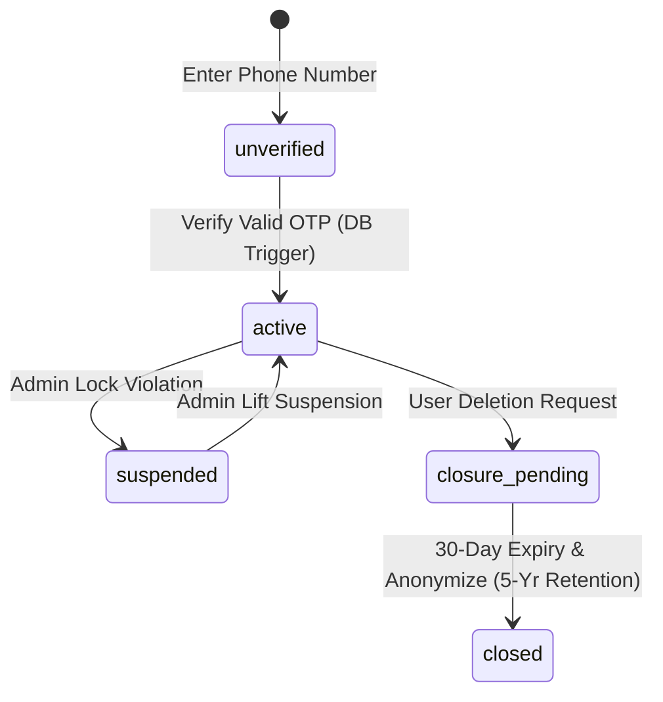
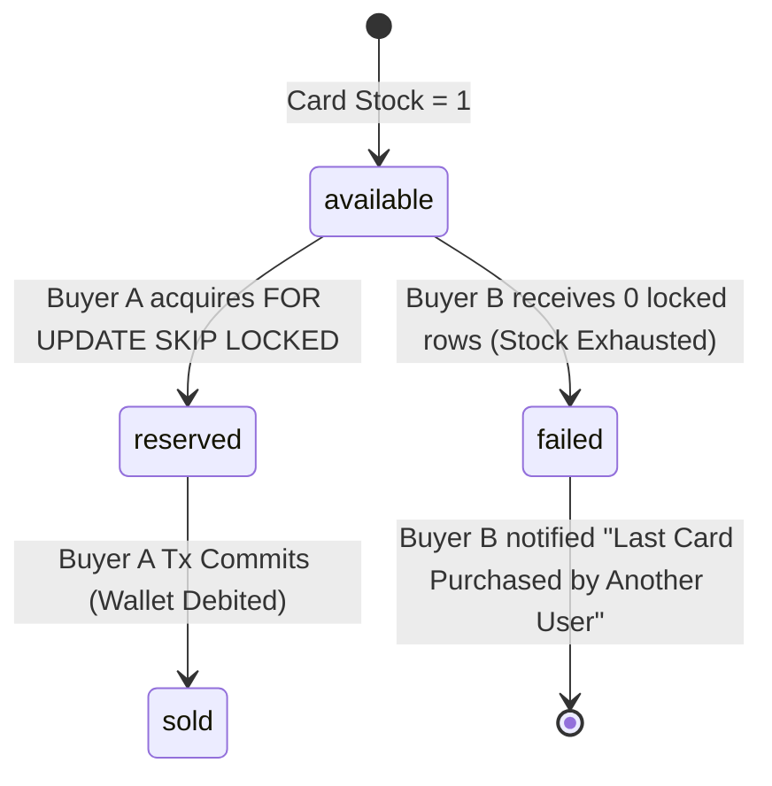
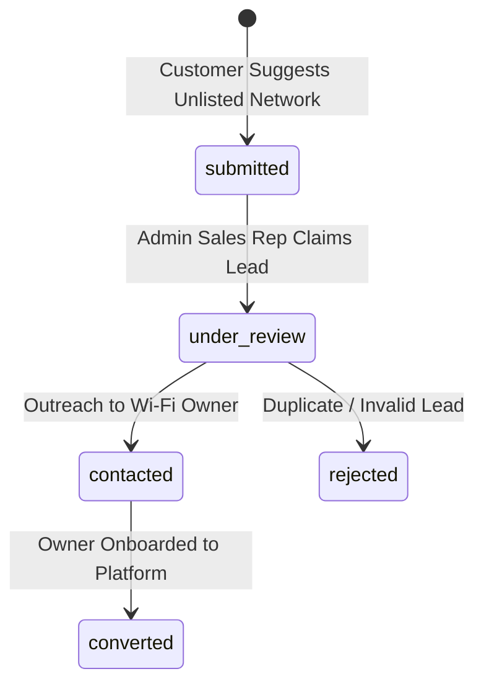

# NETYEMEN WORKFLOW STATE MACHINES (V1.0 + V1.1 ENHANCEMENTS)

**Task ID:** NY-PRODUCT-001  
**Document Code:** `NETYEMEN-WORKFLOW-STATE-MACHINES-01.md`  
**Classification:** `PROPOSED_CONTRACT`  
**Scope:** Core Domain Entity Lifecycle Specifications and Transition Logic (Updated with Lead Queue & Deposit Review Machines)  

---

## 1. Customer Account Lifecycle State Machine

### 1.1 States
* `unverified`: Phone number entered; awaiting OTP verification.
* `active`: Account verified; full access to marketplace, wallet, and purchases.
* `suspended`: Account temporarily locked due to security flag or administrative action.
* `closure_pending`: Account deletion requested; 30-day financial reconciliation grace period active.
* `closed`: Account closed; PII anonymized; historical ledger retained for 5 years per statutory rules.

### 1.2 Transition Matrix

| Current State | Event / Trigger | Triggering Actor | Target State | Pre-conditions | Database & Ledger Side Effects |
|---|---|---|---|---|---|
| `[None]` | Submit Phone | Guest User | `unverified` | Valid Yemen phone format | Issue OTP token log |
| `unverified` | Verify Valid OTP | Guest User | `active` | Valid unexpired OTP | Trigger creates `users` record (`wallet_balance=0`) |
| `active` | Administrative Lock | `PLATFORM_ADMIN` | `suspended` | Documented reason code | Revoke active JWT session tokens |
| `suspended` | Administrative Lift | `PLATFORM_ADMIN` | `active` | Violation resolved | Restore login access; log audit event |
| `active` | Request Deletion | Verified Customer | `closure_pending` | Zero outstanding disputes | Flag account deletion timestamp |
| `closure_pending`| 30-Day Grace Expired | System Worker | `closed` | 30 days elapsed; balance = 0 | Anonymize PII (`full_name`); retain ledger 5 yrs |

### 1.3 State Diagram

---

## 2. Network Owner Verification & Onboarding State Machine

### 2.1 States
* `draft`: Owner profile created; identity details incomplete.
* `pending_verification`: Identity documents uploaded; awaiting Admin verification review.
* `verified`: Commercial identity verified by Admin; owner permitted to create networks and receive "Verified Badge".
* `rejected`: Verification rejected due to invalid documents.
* `suspended`: Owner account locked due to fraud or compliance violation.

---

## 3. Network Approval & Multi-SSID State Machine

### 3.1 States
* `draft`: Network details entered by owner; not submitted for review.
* `submitted`: Submitted for platform listing approval.
* `approved`: Approved by Admin; active for public discovery and card sales.
* `rejected`: Rejected by Admin (e.g., duplicate network name, invalid coverage).
* `suspended`: Suspended by Admin or Owner (sales halted).

---

## 4. Card Inventory & Secure Last-Card Lock State Machine

### 4.1 States
* `available`: Imported and valid; ready for atomic purchase lock.
* `reserved`: Temporarily locked inside active purchase RPC execution (`SELECT ... FOR UPDATE`).
* `sold`: Successfully purchased by customer; card PIN revealed to buyer.
* `quarantined`: Under active complaint investigation post-purchase.
* `invalid`: Confirmed invalid or damaged; excluded from settlement.
* `cancelled`: Voided by owner before sale.

### 4.2 Secure Last-Card Race Condition Transition Matrix

---

## 5. Wallet Deposit Request State Machine

### 5.1 States
* `pending`: Deposit request created by customer with payment receipt attached.
* `under_review`: Claimed by Finance Officer for bank reference verification.
* `approved`: Payment verified in official bank portal; wallet credited via ledger.
* `rejected`: Payment proof invalid or reference unverified.
* `reversed`: Approved deposit reversed due to bank chargeback or fraud audit.

### 5.2 Transition Matrix

| Current State | Event / Trigger | Triggering Actor | Target State | Pre-conditions | Database & Ledger Side Effects |
|---|---|---|---|---|---|
| `[None]` | Submit Deposit | Verified Customer | `pending` | Amount > 0 & Receipt image | Create `wallet_deposit_requests` row |
| `pending` | Claim Review | `FINANCE_OFFICER` | `under_review` | Finance session active | Lock review queue item |
| `under_review` | Confirm Bank Receipt| `FINANCE_OFFICER` | `approved` | Bank reference matches | Insert `CREDIT` row into `wallet_ledger_entries` |
| `under_review` | Reject Proof | `FINANCE_OFFICER` | `rejected` | Ref number invalid | Set status `rejected`; log reason; notify user |
| `approved` | Audit Reversal | `PLATFORM_ADMIN` | `reversed` | Bank transfer cancelled | Insert `REVERSAL` debit into ledger |

---

## 6. Network Addition Lead Request State Machine (NY-PRODUCT-001E)

### 6.1 States
* `submitted`: Customer submits "Suggest New Network" lead in app.
* `under_review`: Admin / Sales Rep opens lead for review.
* `contacted`: Sales rep reaches out to network owner.
* `converted`: Network owner onboarded; lead completed.
* `rejected`: Lead invalid, duplicate, or unviable.

### 6.2 State Diagram

