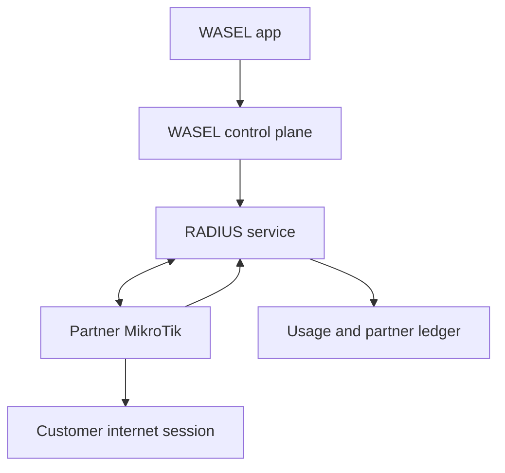

# ADR-006: WASEL One Access Federation

- Status: Accepted for pilot implementation
- Date: 2026-09-22
- Initiative: `WASEL-ONE-PIVOT-001`

## Context

The existing product sells a package belonging to one hotspot and fulfills it as
a card. That flow is useful as a fallback, but it does not deliver the product
promise: one balance and one access identity that works across participating
networks.

Most pilot partners already operate MikroTik Hotspot routers. Replacing that
equipment would make onboarding slow and expensive. The first release must use
the partner's existing router and require configuration, not replacement.

## Decision

WASEL One is the primary product. The platform becomes an access federation:

1. A customer buys one WASEL One plan, independent of a specific hotspot.
2. The plan creates an access entitlement containing time, data, speed, and
   concurrency limits.
3. A participating MikroTik delegates Hotspot authentication and accounting to
   the WASEL RADIUS service.
4. The control plane issues short-lived access grants and authorizes a session
   only when the customer, entitlement, router, and partner network are active.
5. RADIUS accounting events update session consumption idempotently.
6. Closed-session usage produces an auditable partner accrual for settlement.

The existing card purchase path remains available behind a fallback capability.
It is not deleted or used as the data model for federated access.

## Pilot topology

The RADIUS server and control-plane worker may run on one small cloud server for
the pilot, but they remain separate logical components. Supabase remains the
system of record. Router RADIUS shared secrets are held in a secret manager and
must never be stored in client-readable database rows, logs, or the repository.

## Compatibility decision

The pilot integration target is MikroTik RouterOS Hotspot with RADIUS enabled.
The partner keeps the current router, SSID, upstream ISP, and local topology.
Onboarding adds:

- a RADIUS client entry pointing to the WASEL endpoint;
- Hotspot `use-radius` authentication and accounting;
- a short interim accounting interval;
- a restricted firewall path to the RADIUS endpoint;
- an emergency rollback profile that restores the partner's former login flow.

No WASEL appliance is required for the normal pilot. A small optional edge box
is considered only for sites with unstable internet paths to the central RADIUS
service; it is not part of the default architecture.

## Security invariants

- Authorization fails closed if the customer, entitlement, network, or access
  node is inactive, or if central state cannot be verified.
- Access grants are short lived, single purpose, revocable, and never returned
  by public catalog endpoints.
- Accounting ingestion is idempotent by node and event key.
- Cumulative counters may only move forward; derived deltas cannot be negative.
- Raw RADIUS passwords, router secrets, card codes, and device identifiers are
  excluded from accounting payloads. Device correlation uses a salted hash.
- Customers can read only their own entitlements and sessions. Partners can read
  operational and accrual data only for their own networks.
- Usage and financial history are corrected by compensating entries, not by
  rewriting the original event.

## Product migration

| Existing capability | WASEL One role |
| --- | --- |
| Auth, account PIN, profiles | Reused customer identity boundary |
| Wallet and immutable ledger | Reused to buy a WASEL One plan |
| Network catalog and SSID aliases | Reused to discover eligible hotspots |
| Network memberships | Reused for partner authorization |
| Notifications and support | Reused for session and incident lifecycle |
| Settlement batches | Extended to consume usage accruals |
| Network packages and card vault | Retained as a fallback path |

## Release slices

1. **Control-plane foundation:** plans, partner participation, router registry,
   entitlements, sessions, accounting events, and partner usage ledger.
2. **RADIUS adapter:** authentication, authorization attributes, accounting
   ingestion, replay protection, health reporting, and secret rotation.
3. **Customer vertical slice:** buy plan, discover a participating SSID, connect,
   view live consumption, disconnect, and reconnect at another partner.
4. **Partner operations:** guided MikroTik onboarding, health diagnostics,
   usage detail, accruals, and settlement reconciliation.
5. **Pilot hardening:** two real partner networks, outage drills, fraud limits,
   load tests, support runbook, rollback, and measured acceptance criteria.

## Consequences

WASEL owns the customer relationship and the unified entitlement while partners
continue operating local radio access and upstream bandwidth. This is a larger
technical responsibility than reselling cards, but it creates the defensible
network effect: every added partner increases the usefulness of the same plan.
